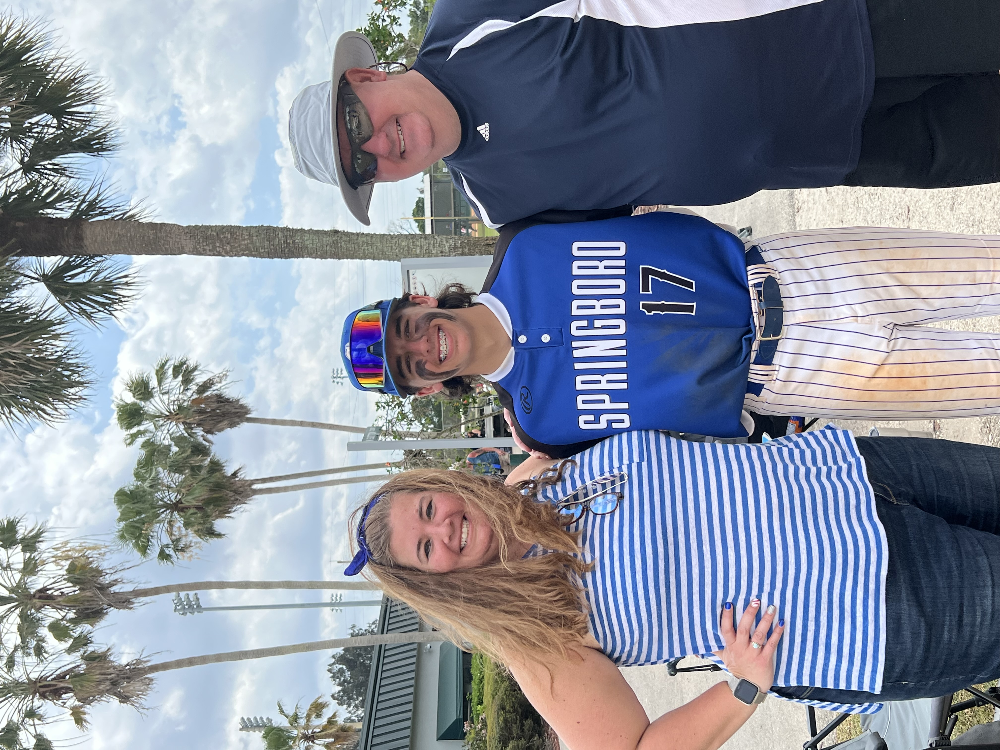

# Week4
<html lang="en">
<head>
  <meta charset="UTF-8">
  <title>My Personal Website</title>
  <link rel="stylesheet" href="styles.css">
</head>
<body>

  <h1>About Me</h1>

  

  

    Hi, my name is Jo, and this website is a simple introduction to who I am.
    I enjoy spending time with my family and being involved in sports.
  

  

    This photo was taken at a baseball game, which is something that’s important
    to me because it represents teamwork, dedication, and having fun together.
  

  

    I created this website to practice using HTML and CSS and to learn how styling
    can improve the overall look and feel of a webpage.
  

</body>
</html>
